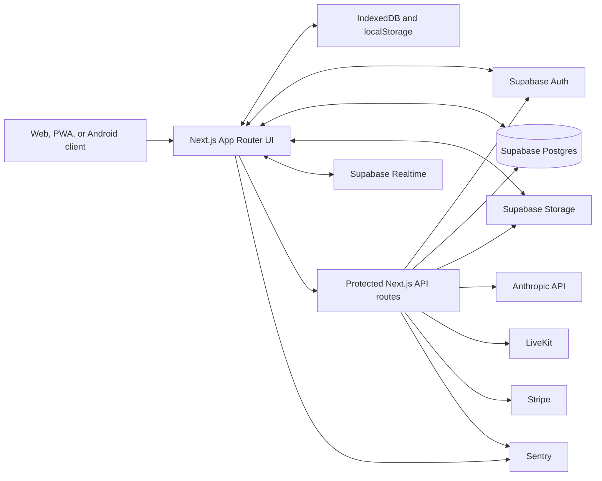

# StudySync

A full-stack collaborative study workspace for reading, annotating, organizing, and discussing academic documents.

## Overview

StudySync brings document review, personal study tools, and live collaboration into one application. Students can work with PDF and PowerPoint files, annotate pages, create structured notes and flashcards, record voice notes, track study activity, and collaborate in invitation-based study rooms.

The project combines a Next.js application with Supabase authentication, PostgreSQL, Storage, and Realtime. Server-side integrations add Anthropic-powered study assistance, LiveKit voice chat, Stripe subscriptions, and Sentry monitoring. Device-local storage keeps imported PDFs and selected workspace state available between sessions, while account-backed data is synchronized through Supabase.

## Features

### Document workspace

- PDF rendering with PDF.js, page thumbnails, search, zoom, fullscreen, single-page and continuous-scroll modes.
- PDF and PPTX import with a 50 MB limit, extension checks, suspicious double-extension detection, and file-signature validation.
- Split workspace for studying a document beside another document or a blank page.
- Freehand pen, marker, highlighter, and eraser tools with independent stroke sizes, undo/redo, and per-page persistence.
- Selectable PDF text with local text-highlight overlays and highlight removal.
- Positioned text notes, categorized notes, bookmarks, inserted images, and configurable blank pages.
- Voice-note recording, playback, titles, page association, and Supabase Storage persistence.
- Notes and bookmarks export to PDF or DOCX.
- Pomodoro timer, document study-time tracking, session progress, and study streaks.

### Organization and review

- Library views with search, sorting, tags, favorites, annotation counts, and study-time summaries.
- Account-backed document metadata and configurable document ordering.
- Flashcard decks with due-card filtering and spaced-review scheduling.
- Global search across documents and application data.

### Authentication and accounts

- Supabase email/password authentication and Google OAuth.
- Registration, login, password reset, profile editing, avatars, and unique normalized user handles.
- Plan-aware limits for documents, AI requests, voice-note storage, and study rooms.
- Stripe Checkout subscriptions with verified webhooks and account-plan updates.
- Referral-code generation and processing.
- Server-controlled account deletion covering database records, Storage objects, hosted-room data, and active Stripe subscriptions.

### Collaboration and community

- Private, invitation-based study rooms with authenticated membership checks.
- Realtime participant presence, document changes, blank pages, voice notes, and drawing events.
- Append-only room stroke events with sequence-based replay and reconnect reconciliation, avoiding shared-canvas last-write-wins data loss.
- Live room voice chat through LiveKit, including mute state, active-speaker indicators, and membership-verified token issuance.
- User search, friend requests, mutual-friend counts, direct messages, unread counts, notifications, and room invitations.
- Community posts with profiles, follows, likes, comments, saved content, and feed filtering.

### AI-assisted study

- Authenticated Anthropic API integration through a protected Next.js route.
- Document-aware chat using extracted PDF page text as optional context.
- Page summaries, simple explanations, translations, flashcard generation, and quiz prompts.
- Per-plan monthly usage enforcement and a basic per-IP request limiter.

### PWA and mobile

- Web app manifest, standalone display metadata, install icons, and a lightweight service worker for manifest and static-asset caching.
- Touch-aware PDF navigation and drawing interactions.
- Checked-in Capacitor Android project with application ID `com.studysync.app`, launcher resources, splash screens, and WebView configuration.

> The current service worker is a lightweight online-first implementation, not a complete offline application shell. The Capacitor configuration targets a development server and should be hardened before a store release.

## Tech Stack

| Area | Technologies |
| --- | --- |
| Frontend | Next.js 16 App Router, React 19, TypeScript, CSS custom properties, Tailwind CSS 4/PostCSS, Lucide React |
| Document tooling | PDF.js, JSZip, html2canvas, jsPDF, `docx` |
| Interaction | dnd-kit, Canvas APIs, MediaRecorder, browser touch and pointer events |
| Backend | Next.js Route Handlers and proxy middleware, Supabase client and SSR SDKs |
| Database | Supabase Postgres, Row Level Security, PostgreSQL functions and triggers |
| Authentication | Supabase Auth, cookie-backed SSR sessions, Google OAuth |
| Realtime and media | Supabase Realtime, LiveKit client/server SDKs, Supabase Storage |
| AI | Anthropic TypeScript SDK |
| Billing | Stripe Checkout, subscriptions, and webhook processing |
| Mobile | PWA manifest/service worker, Capacitor Android project |
| Observability | Sentry for Next.js |
| Deployment | Vercel |

## Architecture

StudySync uses a hybrid client/server architecture. The browser handles PDF rendering, canvas interaction, and responsive workspace state. Authenticated application data is read and written directly through Supabase under RLS, while privileged operations and third-party secrets remain behind Next.js server routes.



Key architectural boundaries:

- Imported personal PDF blobs are stored in IndexedDB databases scoped by authenticated user ID.
- Annotation caches use browser storage for responsive local rendering and Supabase for account-backed persistence where implemented.
- Realtime study rooms use private `room:<uuid>` channels and database-backed reconciliation.
- Service-role credentials, AI credentials, Stripe secrets, and LiveKit secrets are used only in server-side routes.

## Database Design

The application uses Supabase Postgres as its system of record. The data model covers profiles, documents, annotations, voice notes, bookmarks, preferences, flashcards, friendships, messages, notifications, community content, subscriptions, referrals, study sessions, and collaborative room state.

Notable migration-backed designs include:

- `flashcard_decks` and review metadata for scheduled flashcard practice.
- `room_strokes`, an append-only JSONB event log ordered by sequence number for convergent collaborative drawing replay.
- `room_invitations` and atomic room-join functions for server-enforced private-room access and capacity limits.
- `room_document_events` for durable document-change reconciliation.
- Unique, normalized profile handles with hardened helper functions.
- Atomic AI usage increments for per-user monthly limits.
- RLS hardening for referrals, subscriptions, room drawings, room membership data, and private realtime messages.
- A service-role-only account-deletion function that removes user-owned records while preserving shared-data integrity.

Migration files live in [`supabase/migrations`](./supabase/migrations). Some historical files use date-based names rather than the Supabase CLI timestamp format; verify local and remote migration history before running `supabase db push` against an existing project.

## Security

Implemented controls include:

- Server-validated Supabase sessions for protected application routes.
- Bearer-token or cookie authentication for privileged API operations.
- RLS policies and explicit `user_id` or room-membership checks on account and collaboration data.
- Private realtime channel authorization for study-room broadcast and presence traffic.
- Atomic `SECURITY DEFINER` room functions with restricted execution grants and explicit `search_path` settings.
- Server-only use of the Supabase service-role key, Anthropic key, Stripe secrets, and LiveKit secrets.
- Stripe webhook signature verification before subscription updates.
- LiveKit token identity and room-membership validation to prevent voice-room impersonation.
- Origin allowlisting for browser API requests, security response headers, and no-store headers on protected pages.
- File size, extension, magic-byte, and suspicious filename validation for PDF/PPTX uploads.
- Authenticated, service-controlled account deletion with Storage and subscription cleanup.

Never expose `SUPABASE_SERVICE_ROLE_KEY`, `ANTHROPIC_API_KEY`, `STRIPE_SECRET_KEY`, `STRIPE_WEBHOOK_SECRET`, or LiveKit server credentials to client code.

## Deployment

The production application is deployed on Vercel. Supabase provides the managed database, authentication, realtime channels, and object storage. Stripe, Anthropic, LiveKit, and Sentry are configured through deployment environment variables.

### Local installation

Prerequisites:

- Node.js 20.9 or newer
- npm
- A Supabase project with the required schema and Storage buckets
- Optional credentials for Anthropic, Stripe, LiveKit, and Sentry when testing those integrations

```bash
git clone https://github.com/Muj-04/studysync.git
cd studysync
npm ci
```

Create `.env.local` and configure the integrations you intend to run:

```env
NEXT_PUBLIC_SUPABASE_URL=
NEXT_PUBLIC_SUPABASE_ANON_KEY=
SUPABASE_SERVICE_ROLE_KEY=

ANTHROPIC_API_KEY=

STRIPE_SECRET_KEY=
STRIPE_WEBHOOK_SECRET=
NEXT_PUBLIC_APP_URL=http://localhost:3000

LIVEKIT_API_KEY=
LIVEKIT_API_SECRET=
LIVEKIT_URL=

# Optional monitoring
NEXT_PUBLIC_SENTRY_DSN=
SENTRY_AUTH_TOKEN=
```

Apply the reviewed Supabase migrations in chronological order to a compatible schema, then start the application:

```bash
npm run dev
```

Open [http://localhost:3000](http://localhost:3000).

### Development commands

| Command | Purpose |
| --- | --- |
| `npm run dev` | Start the Next.js development server |
| `npm run build` | Create and validate a production build |
| `npm run start` | Run the production build locally |
| `npm run lint` | Run ESLint |
| `npx tsc --noEmit` | Run an explicit TypeScript check |

### Production checklist

1. Configure all required environment variables in Vercel.
2. Set `NEXT_PUBLIC_APP_URL` to the production origin.
3. Configure Supabase Auth redirect URLs, including `/auth/callback`.
4. Apply and verify database migrations before deploying application code that depends on them.
5. Point Stripe webhooks to `/api/stripe/webhook` and configure the signing secret.
6. Configure LiveKit credentials if study-room voice chat is enabled.
7. Run `npm run build` before deployment.

## Project Structure

```text
StudySync/
├── src/
│   ├── app/                 # App Router pages, layouts, error boundaries, and API routes
│   ├── components/          # PDF, annotation, navigation, chat, voice, and workspace UI
│   ├── contexts/            # Shared client contexts, including localization
│   ├── hooks/               # Document, annotation, room, voice, auth, and study-state hooks
│   ├── lib/                 # Supabase access, storage, validation, export, and domain utilities
│   └── proxy.ts             # Authentication redirects and API origin policy
├── supabase/
│   └── migrations/          # PostgreSQL schema changes, RLS policies, indexes, and RPCs
├── android/                 # Capacitor-generated Android application project
├── public/                  # PWA manifest, service worker, icons, images, and PDF.js worker
├── capacitor.config.ts      # Android WebView/Capacitor configuration
├── next.config.ts           # Next.js, security-header, cache, and Sentry configuration
└── package.json             # Scripts and JavaScript dependencies
```

## Screenshots

> Add application screenshots here.

Suggested views:

- PDF workspace and annotation toolbar
- Split document/blank-page workspace
- Realtime study room
- Library and flashcard review
- Friends and community screens
- Mobile/PWA interface

## Technical Challenges

- **Convergent realtime drawing:** Study-room drawing moved from whole-canvas PNG replacement to append-only stroke events. Sequence-based replay and database reconciliation preserve concurrent strokes and recover from dropped realtime packets.
- **Secure room access:** Room joining, capacity checks, invitations, realtime authorization, and voice-token issuance are enforced server-side instead of trusting UI state.
- **Document identity and persistence:** Local imports receive stable IDs, adopt canonical account-backed IDs when necessary, and persist PDF blobs in authenticated-user-scoped IndexedDB storage.
- **Complex annotation state:** The workspace coordinates PDF rendering, blank pages, split views, drawing history, touch gestures, text notes, highlights, images, bookmarks, and voice notes without modifying the source PDF.
- **Privileged lifecycle operations:** Checkout, webhook processing, referral workflows, room departure, AI usage accounting, and account deletion are separated into authenticated server routes or restricted database functions.
- **Cross-platform interaction:** The same workspace supports desktop mouse input, touch gestures, an installable web experience, and a Capacitor Android WebView shell.

## Future Improvements

- Build a complete offline application shell with versioned asset precaching and a durable synchronization outbox.
- Synchronize personal PDF binaries, text highlights, zoom, and workspace progress across devices.
- Add explicit conflict resolution for annotations edited concurrently on multiple devices.
- Expand stylus pressure, palm rejection, and mobile-responsive workspace behavior.
- Complete production hardening and automated release workflows for the Capacitor Android application.
- Add end-to-end tests for authentication, document persistence, study rooms, billing, and account deletion.
- Add accessibility audits, performance budgets, and large-document memory profiling.

## Live Demo

[https://pdf-study-workspace.vercel.app](https://pdf-study-workspace.vercel.app)

## Author

[Muj-04](https://github.com/Muj-04)
